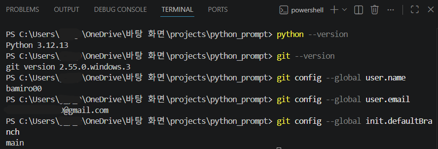
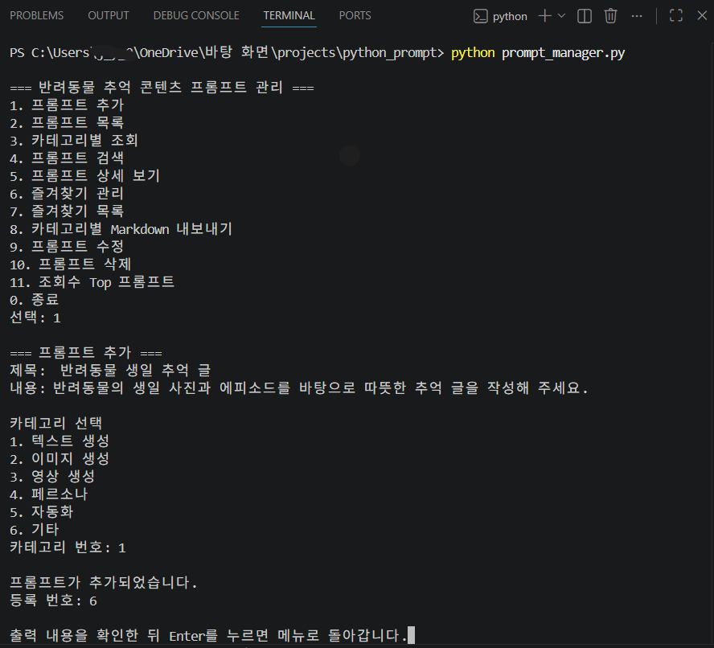
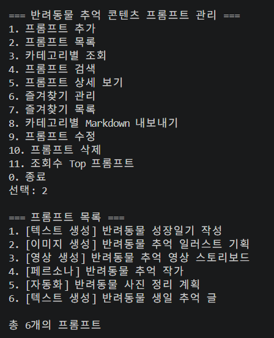
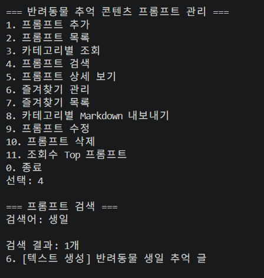
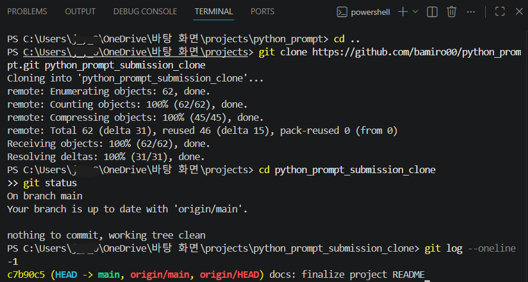
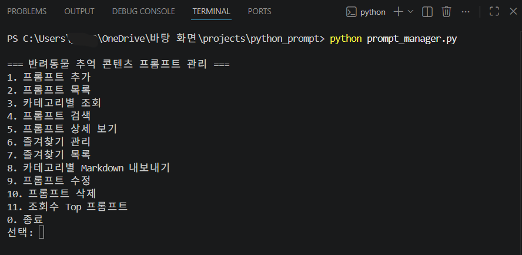
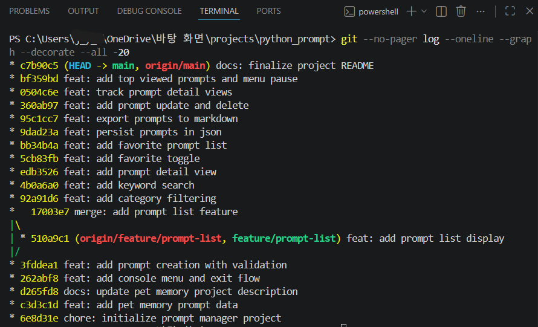
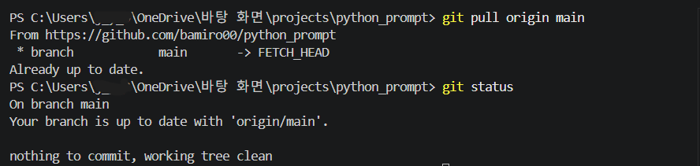
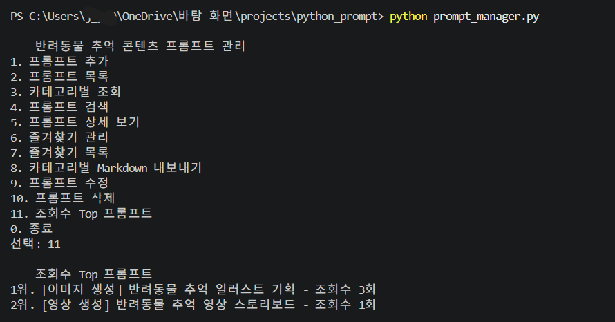
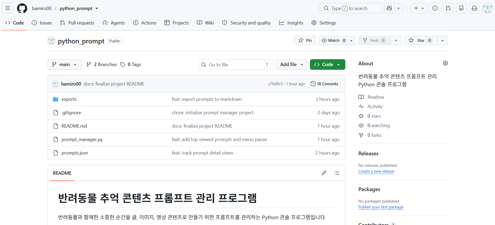

# 반려동물 추억 콘텐츠 프롬프트 관리 프로그램

반려동물과 함께한 소중한 순간을 글, 이미지, 영상 콘텐츠로 만들기 위한 프롬프트를 관리하는 Python 콘솔 프로그램입니다.

Python의 리스트와 딕셔너리, 조건문, 반복문, 함수, 파일 입출력을 활용하여 제작했습니다.

## 개발 환경

- Python 3.10 이상
- Visual Studio Code
- Git
- GitHub
- 외부 라이브러리 사용 없음

<details>
<summary>개발 환경 설정 화면 보기</summary>

<br>

Python 버전, Git 버전, Git 사용자 정보와 기본 브랜치 설정을 확인한 화면이다.



</details>


## 주요 기능

1. 프롬프트 추가
2. 전체 프롬프트 목록 보기
3. 카테고리별 프롬프트 조회
4. 제목 또는 내용으로 프롬프트 검색
5. 프롬프트 상세 보기
6. 즐겨찾기 추가 및 해제
7. 즐겨찾기 목록 보기
8. 카테고리별 Markdown 파일 내보내기
9. 프롬프트 수정
10. 프롬프트 삭제
11. 조회수 기준 Top 프롬프트 보기
12. JSON 파일 저장 및 불러오기

### 주요 기능 실행 예시

#### 1. 프롬프트 추가

제목, 내용, 카테고리를 입력하여 새로운 프롬프트를 등록할 수 있다.

<details>
<summary>프롬프트 추가 화면 보기</summary>

<br>



</details>

#### 2. 프롬프트 목록

저장된 모든 프롬프트를 번호, 카테고리, 제목과 함께 확인할 수 있다.

<details>
<summary>프롬프트 목록 화면 보기</summary>

<br>



</details>

#### 3. 프롬프트 검색

제목 또는 내용에 포함된 검색어를 입력하여 관련 프롬프트를 찾을 수 있다.

<details>
<summary>프롬프트 검색 화면 보기</summary>

<br>



</details>


## 프롬프트 데이터 구조

각 프롬프트는 다음 정보를 포함합니다.

- 고유 번호
- 제목
- 내용
- 카테고리
- 즐겨찾기 여부
- 상세 조회수

## 기본 카테고리

- 텍스트 생성
- 이미지 생성
- 영상 생성
- 페르소나
- 자동화
- 기타

## 기본 프롬프트

프로그램을 처음 실행하면 다음 5개의 프롬프트를 사용할 수 있습니다.

1. 반려동물 성장일기 작성
2. 반려동물 추억 일러스트 기획
3. 반려동물 추억 영상 스토리보드
4. 반려동물 추억 작가
5. 반려동물 사진 정리 계획

## 실행 방법

### 1. 저장소 내려받기

```bash
git clone https://github.com/bamiro00/python_prompt.git
```
<details>
<summary>Git clone 확인 화면 보기</summary>

<br>

GitHub 원격 저장소를 별도 폴더에 복제한 뒤 브랜치, 작업 상태와 최신 커밋을 확인한 화면입니다.



</details>


### 2. 프로젝트 폴더로 이동

```bash
cd python_prompt
```

### 3. 프로그램 실행

```bash
python prompt_manager.py
```

<details>
<summary>프로그램 메인 메뉴 화면 보기</summary>

<br>

프로그램을 실행하면 프롬프트 관리 기능을 번호로 선택할 수 있는 메인 메뉴가 표시됩니다.



</details>


## 메뉴 화면

프로그램을 실행하면 다음 메뉴가 표시됩니다.

```text
=== 반려동물 추억 콘텐츠 프롬프트 관리 ===
1. 프롬프트 추가
2. 프롬프트 목록
3. 카테고리별 조회
4. 프롬프트 검색
5. 프롬프트 상세 보기
6. 즐겨찾기 관리
7. 즐겨찾기 목록
8. 카테고리별 Markdown 내보내기
9. 프롬프트 수정
10. 프롬프트 삭제
11. 조회수 Top 프롬프트
0. 종료
선택:
```

각 기능의 출력 내용을 확인한 뒤 Enter를 누르면 메인 메뉴로 돌아갑니다.


## 데이터 저장

프롬프트 데이터는 프로젝트 폴더의 다음 JSON 파일에 저장됩니다.

```text
prompts.json
```

새 프롬프트 추가, 수정, 삭제, 즐겨찾기 변경 및 상세 조회수는 JSON 파일에 자동으로 저장됩니다.

따라서 프로그램을 종료하고 다시 실행해도 변경된 데이터가 유지됩니다.

## Markdown 내보내기

메뉴에서 `8. 카테고리별 Markdown 내보내기`를 실행하면 다음 폴더에 카테고리별 Markdown 파일이 생성됩니다.

```text
exports/
```

생성되는 파일의 예시는 다음과 같습니다.

```text
exports/
├─ 텍스트_생성.md
├─ 이미지_생성.md
├─ 영상_생성.md
├─ 페르소나.md
└─ 자동화.md
```

프롬프트가 없는 카테고리의 Markdown 파일은 생성되지 않습니다.

## 프로젝트 파일 구조

```text
python_prompt/
├─ exports/
│  ├─ 텍스트_생성.md
│  ├─ 이미지_생성.md
│  ├─ 영상_생성.md
│  ├─ 페르소나.md
│  └─ 자동화.md
├─ .gitignore
├─ prompt_manager.py
├─ prompts.json
└─ README.md
```

## Git 브랜치 작업

프롬프트 목록 기능은 별도의 브랜치에서 개발한 후 `main` 브랜치에 병합했습니다.

사용한 브랜치는 다음과 같습니다.

```text
feature/prompt-list
```

브랜치를 생성하고 이동할 때 `git checkout`을 사용했으며, 기능 구현 후 `git merge`를 사용하여 `main` 브랜치에 병합했습니다.

### Git 커밋 및 브랜치 그래프

기능별 커밋 기록과 `feature/prompt-list` 브랜치를 생성한 뒤 `main` 브랜치에 병합한 이력을 확인할 수 있습니다.



<details>
<summary>Git pull 및 최종 상태 확인 화면 보기</summary>

<br>

원격 저장소의 최신 내용을 가져온 뒤 로컬 `main` 브랜치가 원격 저장소와 동일하고 작업 트리가 깨끗한 상태임을 확인한 화면입니다.



</details>


## 구현한 보너스 기능

### 보너스 1: 프롬프트 영속화 및 내보내기

- 프롬프트 데이터를 JSON 파일에 저장
- 프로그램 시작 시 JSON 데이터 불러오기
- 카테고리별 Markdown 파일 내보내기

### 보너스 2: 프롬프트 관리 및 사용 기록

- 프롬프트 수정
- 프롬프트 삭제
- 상세 보기 조회수 기록
- 조회수 기준 Top 프롬프트 목록

<details>
<summary>조회수 Top 프롬프트 실행 결과 보기</summary>

<br>

프롬프트 상세 보기 횟수를 기록하고 조회수가 높은 프롬프트를 내림차순으로 정렬한 결과입니다.



</details>

## 참고 사항

- Python 3.10 이상에서 실행할 수 있습니다.
- 외부 라이브러리 없이 Python 기본 문법과 표준 라이브러리만 사용했습니다.
- 프롬프트 번호는 각 데이터를 구분하는 고유 번호입니다.
- 프로그램 실행 중 변경된 내용은 `prompts.json`에 저장됩니다.
- 조회수는 프롬프트 상세 보기를 실행할 때마다 1회씩 증가합니다.
- 조회수 Top 목록은 조회수가 높은 프롬프트부터 최대 3개까지 보여줍니다.

---

## GitHub 저장소 확인

프로젝트 소스 코드, JSON 데이터, Markdown 내보내기 결과, README와 Git 커밋 기록을 GitHub 원격 저장소에서 확인할 수 있습니다.

- 저장소: [bamiro00/python_prompt](https://github.com/bamiro00/python_prompt)


<details>
<summary>GitHub 저장소 화면 보기</summary>

<br>



</details>